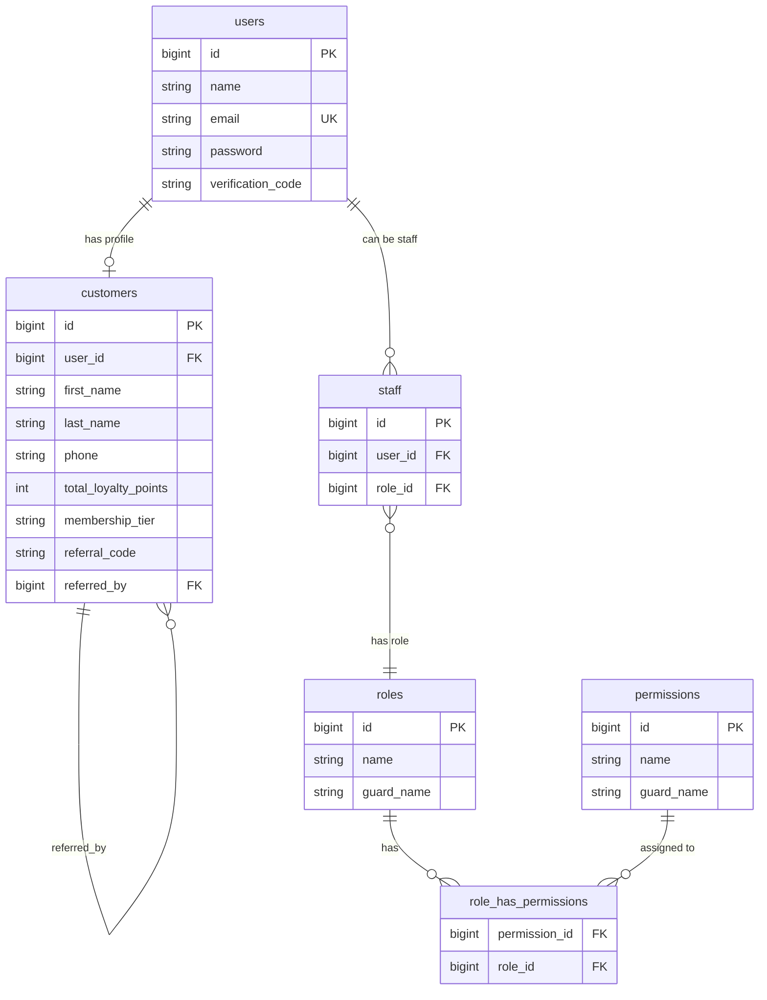
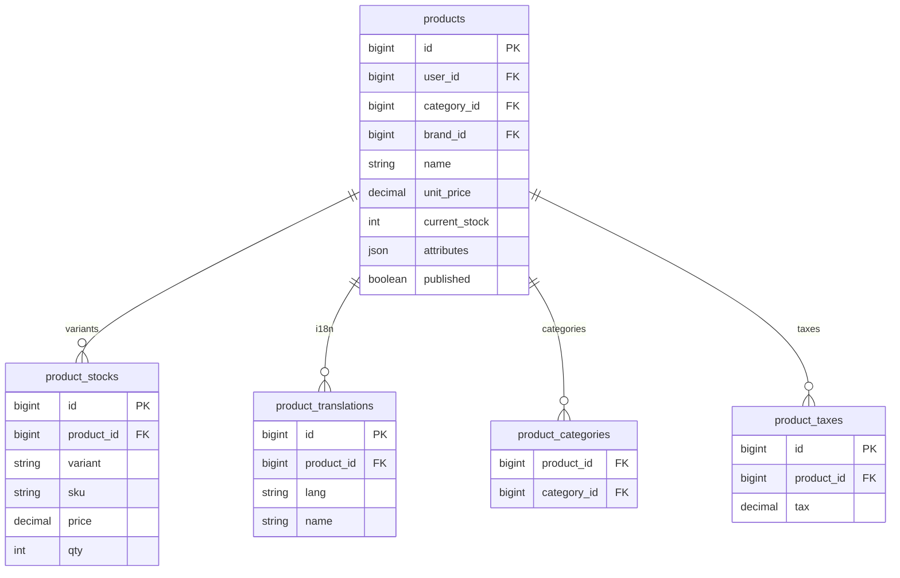
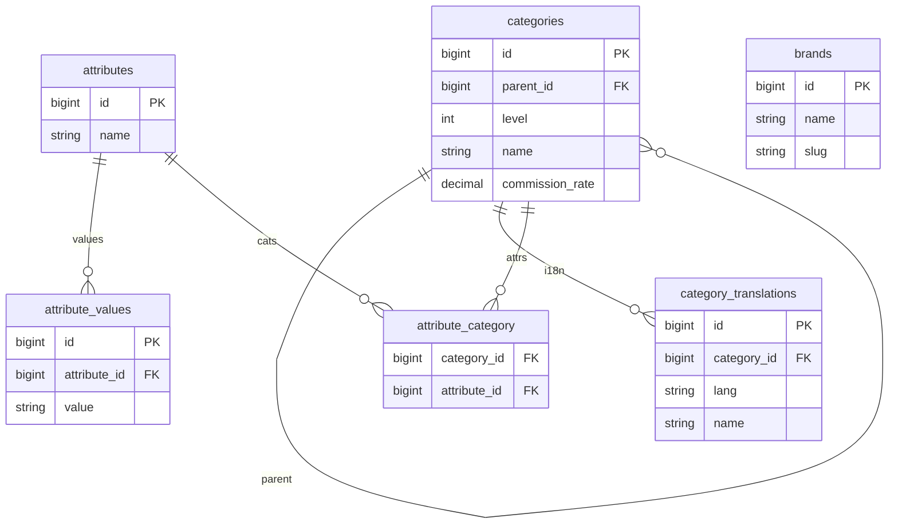
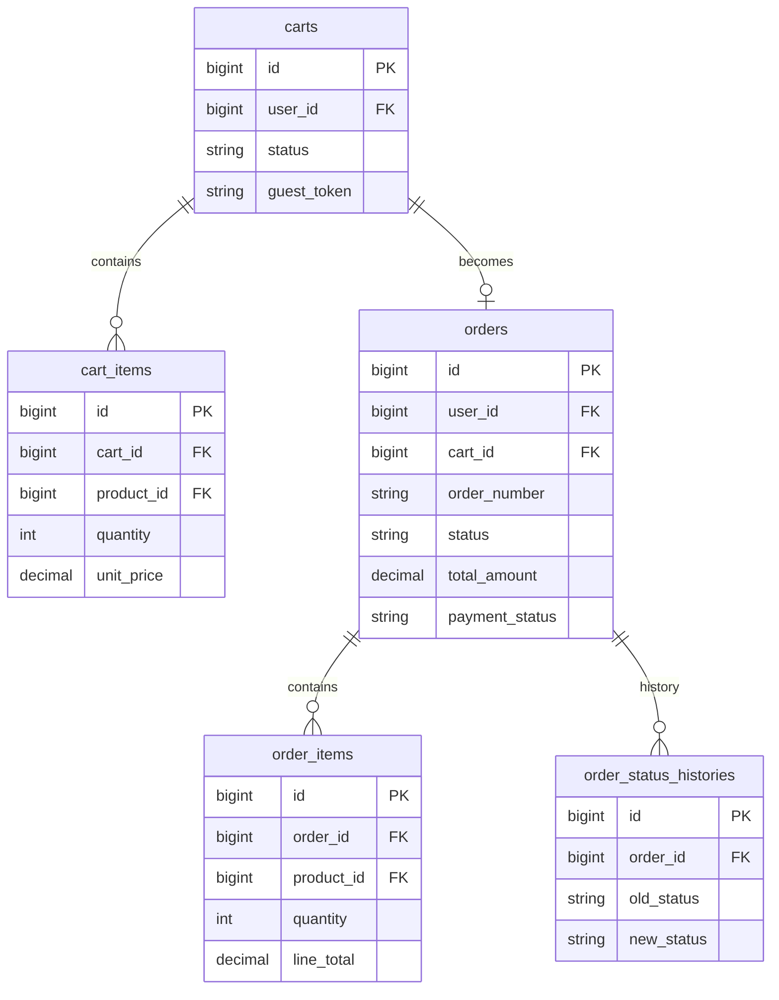
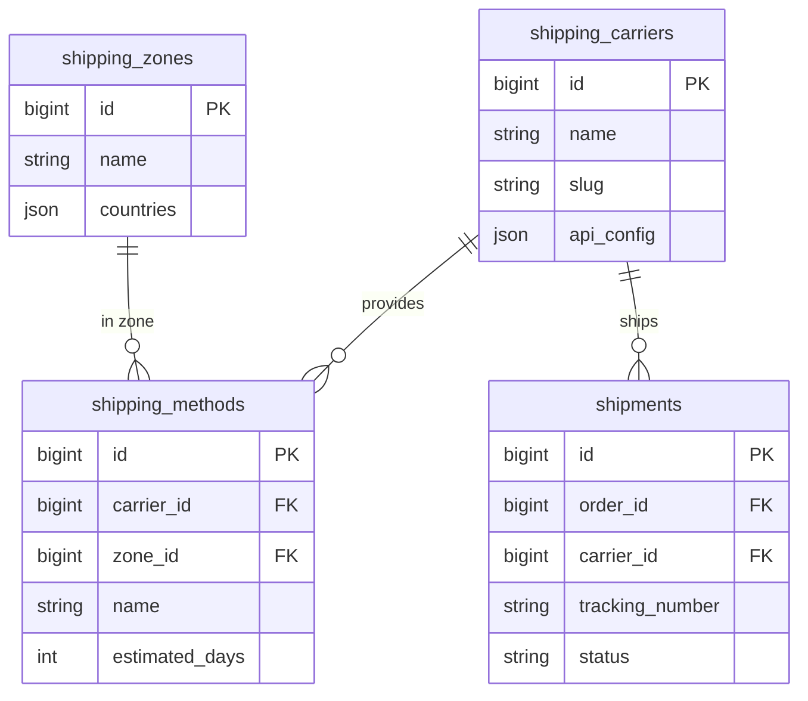
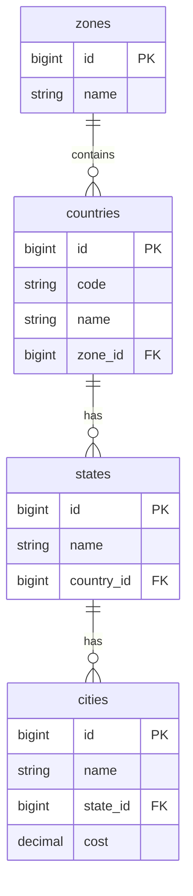
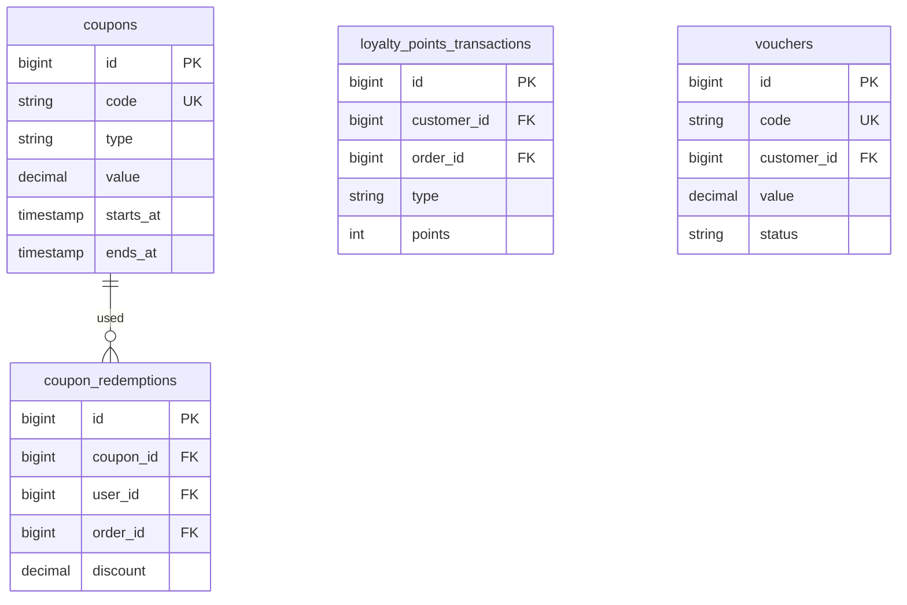
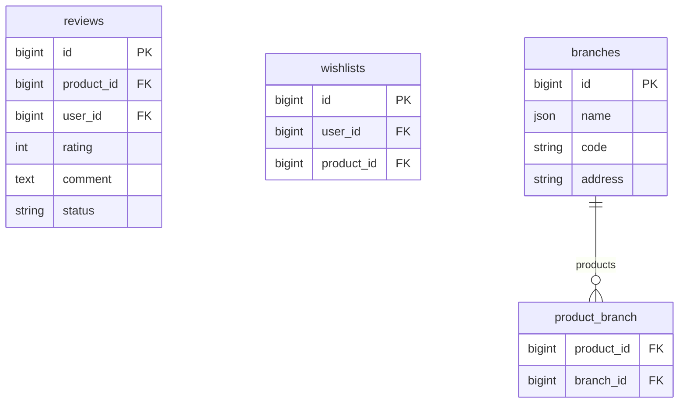
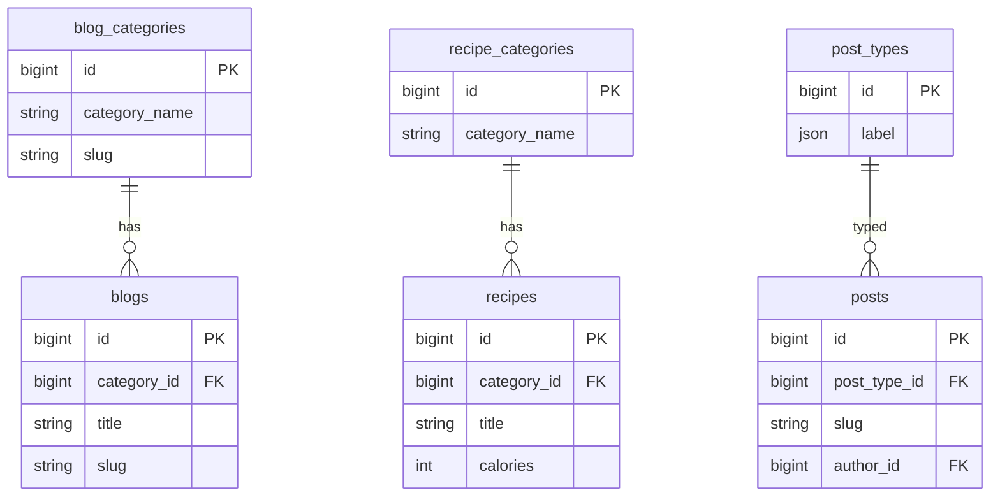
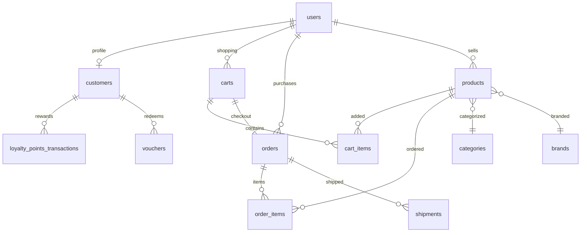

# DNP Database Entity Relationship Diagram

## Overview

This document contains the complete database schema for the DNP multi-vendor nutrition e-commerce platform.

---

## 1. Users & Authentication

---

## 2. Products & Catalog

---

## 3. Categories & Attributes

---

## 4. Shopping Cart & Orders

---

## 5. Shipping & Logistics

---

## 6. Geographic Data

---

## 7. Coupons & Loyalty

---

## 8. Reviews & Wishlists

---

## 9. Content & CMS

---

## 10. Cross-Domain Relationships (Overview)

---

## Table Summary by Domain

| Domain | Tables | Description |
|--------|--------|-------------|
| **Authentication** | users, customers, staff, roles, permissions, role_has_permissions, model_has_roles, model_has_permissions, personal_access_tokens | User management & RBAC |
| **Products** | products, product_stocks, product_translations, product_categories, product_taxes, product_commissions, product_stock_transactions, frequently_bought_products, product_branch | Product catalog |
| **Categories** | categories, category_translations, attributes, attribute_translations, attribute_values, attribute_category | Categorization & attributes |
| **Brands** | brands, brand_translations | Brand management |
| **Shopping** | carts, cart_items | Shopping cart |
| **Orders** | orders, order_items, order_status_histories | Order management |
| **Shipping** | shipping_carriers, shipping_zones, shipping_methods, shipments, pickups, carriers, carrier_ranges, carrier_range_prices | Shipping & logistics |
| **Geographic** | zones, countries, states, cities, city_translations | Location data |
| **Discounts** | coupons, coupon_redemptions | Promotions |
| **Loyalty** | loyalty_points_transactions, loyalty_settings, vouchers | Rewards program |
| **Engagement** | wishlists, reviews | User engagement |
| **Branches** | branches, product_branch | Multi-location |
| **Content** | blogs, blog_categories, blog_translations, posts, post_types, post_translations, post_type_categories, recipes, recipe_categories, recipe_translations | CMS |
| **Media** | uploads, media, media_folders, tags, media_tag | File management |
| **Forms** | forms, form_fields, form_submissions, field_groups, field_group_rules, custom_fields, custom_field_values, blocks | Dynamic forms |
| **Settings** | business_settings, settings, translations, app_translations, languages, currencies, bmi_settings, bmi_records | Configuration |
| **Notifications** | notifications, notification_types, notification_type_translations | Alerts |
| **System** | password_resets, password_reset_tokens, failed_jobs, social_credentials, personal_access_tokens, searches, payku_transactions, payku_payments | System tables |

---

## Key Relationships Summary

### Foreign Key Cascade Behavior

| Relationship | On Delete |
|--------------|-----------|
| users → customers | CASCADE |
| users → carts | CASCADE |
| users → orders | SET NULL |
| users → reviews | CASCADE |
| carts → cart_items | CASCADE |
| orders → order_items | CASCADE |
| orders → shipments | CASCADE |
| categories → category_translations | CASCADE |
| products → product_stock_transactions | CASCADE |
| shipping_carriers → shipments | RESTRICT |
| coupons → coupon_redemptions | CASCADE |
| customers → loyalty_points_transactions | CASCADE |

### Polymorphic Relationships

1. **model_has_roles** - Assigns roles to any model (users, staff, etc.)
2. **model_has_permissions** - Assigns permissions to any model
3. **notifications** - Laravel polymorphic notifications

### Many-to-Many Pivot Tables

| Pivot Table | Table 1 | Table 2 |
|-------------|---------|---------|
| product_categories | products | categories |
| attribute_category | attributes | categories |
| product_branch | products | branches |
| media_tag | media | tags |
| wishlists | users | products |
| role_has_permissions | roles | permissions |

---

## Notes

- All tables use `bigint` for primary keys with auto-increment
- Most tables include `created_at` and `updated_at` timestamps
- Soft deletes (`deleted_at`) on: categories, recipes, recipe_categories, blog_categories, blogs, uploads
- JSON columns used for flexible data: product attributes, addresses, carrier configs, form data
- Multi-language support via `*_translations` tables linked by foreign key
